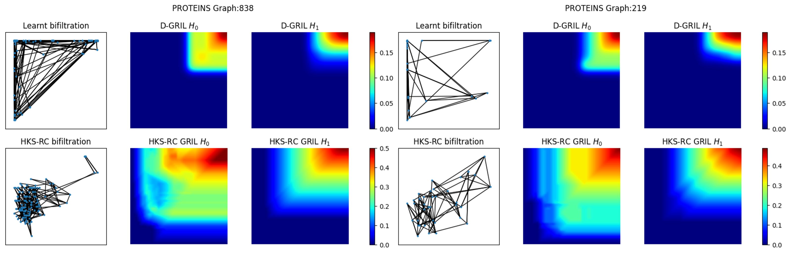

# D-Gril: End-to-End Topological Learning with 2-parameter Persistence

This codebase contains implementation and experiments with D-GRIL: Differentiable GRIL. 


## Instructions
First clone this repo to say $MPML. Then create a conda environment by

    conda create -n mpml python=3.10.4
    
    conda activate mpml

    conda install pytorch==2.0.1 torchvision==0.15.2 torchaudio==2.0.2 pytorch-cuda=11.7 -c pytorch -c nvidia

    python -m pip install torch_geometric==2.4.0    
    

**Additional Dependencies:**

1. Boost
2. OpenMP
3. Molfeat ```(pip install "molfeat[all]")``` [To run ChEMBL experiments, can be found https://molfeat-docs.datamol.io/stable/]
4. rdKit
5. chembl_webresource_client

Then we need to compile mpml. The code is tested with gcc-9.3.0 with CUDA 11.7

    cd $MPML
    cd gril
    python -m pip install -e .

## Running Experiments



### ChEMBL Experiments
#### Downloading the Dataset
```python
python dataset_acquire.py --chembl_id CHEMBL1163125 --output_dir CHEMBL1163125/raw
```
This will download CHEMBL1163125 dataset as a CHEMBL1163125.csv file.

#### Running the Experiment
```python
python train_engine.py --dataset CHEMBL1163125 --model GIN_MPML 
```
#### Optional Flags
To concatenate the D-GRIL fingerprints with other fingerprints such as ECFP, run:
```python
python train_engine.py --dataset CHEMBL1163125 --model GIN_MPML --fp ecfp
```
Currently ECFP, Morgan2 and Morgan3 fingerprints are supported. The default additional fingerprints is ````None````.

### Graph Experiments
```python
python train_engine.py --dataset PROTEINS --model GIN_MPML
```
To run graph experiments on PROTEINS dataset.

### Hyperparameters
```train_engine.py``` contains 
```
__training_cfg
__model_cfg_meta
__exp_cfg_meta
```
These three dicts are used to control hyperparameters of the experiment.


### Results
Please see [results.ipynb](./results.ipynb) notebook to reproduce and browse results of the experiments.

### Additional Information
The directory "d_gril_fixed_centers" contains the code to run D-GRIL with centers fixed. The instructions to run that version is exactly the same as the ones given above.

### Citation
```
@article{mukherjee2024dgrilendtoendtopologicallearning,
      title={D-GRIL: End-to-End Topological Learning with 2-parameter Persistence}, 
      author={Soham Mukherjee and Shreyas N. Samaga and Cheng Xin and Steve Oudot and Tamal K. Dey},
      year={2024},
      eprint={2406.07100},
      archivePrefix={arXiv},
      primaryClass={cs.LG},
      url={https://arxiv.org/abs/2406.07100}, 
}
```
